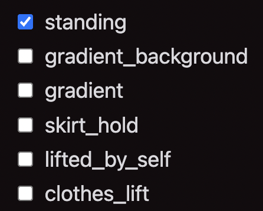

# booru

A lightweight tag based image board.


## Notice

This project is in alpha. Installation and usage instructions will likely
change and essential functionality may be missing.

## Features

- Uses SQLite to store metadata - no database server needed!
- Simple single passphrase authentication
- Image thumbnail generation
- Tag search
- Clean and responsive layout (mobile friendly)
- Automatically extracts tags from NovelAI generated images (using a Danbooru filter)
- Integrated image tag suggestions (optional)

## Installation

1. Ensure [Docker](https://docs.docker.com/engine/install/) is installed. If you do
   not wish to use Docker, try following the **Development** instructions below.

2. Clone this repository:

   ```
   git clone https://github.com/p4ckysm4cky/booru.git
   ```

3. Build the container:

   ```
   docker build -t booru ./booru
   ```

4. Run the container:

   ```
   docker run \
   --publish $PORT:$PORT
   --env PORT=$PORT \
   --env SECRET=$SECRET \
   --env PASSWORD=$PASSWORD \
   --volume "$(pwd)"/booru/data:/app/data \
   --detach -t booru
   ```

   replacing `$PORT` with the port to expose the server on, `$SECRET` with
   a random string, and `$PASSWORD` with a password.

5. Access the site on `http://localhost:$PORT`.

## Development

1. Clone this repository:

   ```
   git clone https://github.com/p4ckysm4cky/booru.git
   ```

2. Enter the repository directory:

   ```
   cd booru
   ```

3. Install dependencies:

   ```
   npm install
   ```

4. Ensure the database has been migrated to the latest version:

   ```
   npm run migrate
   ```

5. Start the development server:

   ```
   npm run dev
   ```

Open <http://localhost:3000> with your browser to view the app.

To access authenticated routes, set these environment variables
(in a `.env.local` file or otherwise):

- `SECRET`
- `PASSWORD`

## Optional configuration

### Image tag suggestions

To integrate with a service that suggests tags for an image
(such as https://github.com/nanoskript/deepdanbooru-docker),
set the environment variable `SUGGEST_TAGS_ENDPOINT` to the service endpoint URL:

```
docker run \
--env SUGGEST_TAGS_ENDPOINT=https://... \
...
```

This will add the `Suggest` button to the image tag editing interface:


When clicked, `booru` will send a multipart `POST` request to the
specified URL with the image under the `"image"` key. The service must return
a JSON list of suggested tags for the image:

```json
[
  {
    "tag": "..."
  },
  ...
]
```

The suggested tags will appear in the tag editing interface:



### Prevent indexing

To prevent search engines (such as Google) from indexing the site, add the
`NEXT_PUBLIC_NO_INDEX` argument to the Docker build command:

```
docker build --build-arg NEXT_PUBLIC_NO_INDEX=true ...
```
